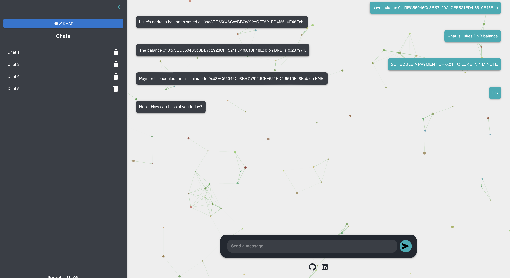

# Wired: Manage Your Assets with Ease

This project provides a conversational interface (via Natural Language) to interact with blockchain functionalities. It allows users to send BNB and AVAX, check balances, schedule transactions, manage aliases for addresses, and even chat or ask questions, all within a user-friendly environment.



## Key Features

- **Send BNB & AVAX**: Initiate transactions to send BNB or AVAX to specified addresses.
- **Cross-Chain Transactions**: Seamlessly interact with both BNB Smart Chain and Avalanche.
- **Check Balances Across Chains**: Easily retrieve wallet balances for both networks.
- **Schedule Sends**: Schedule BNB or AVAX transactions for a specific time in the future.
- **Assign Alias to Addresses**: Give human-readable aliases to wallet addresses.
- **Chain Commands**: Chain multiple commands in one conversation.
- **DeFi Position Management (Upcoming Feature)**: Manage yield farming, liquidity pools, and DeFi positions on Avalanche.
- **Cross-Chain Asset Bridging (Upcoming Feature)**: Move assets between chains automatically.
- **Chat or Ask Questions**: Use the conversational interface (powered by Eliza-like AI) to chat or query information.

## Project Structure

```
├── README.md
├── backend
│   ├── README.md
│   ├── __pycache__
│   ├── avalanche_interaction.py
│   ├── avalanche_defi.py          # DeFi management (if applicable)
│   ├── cross_chain.py             # Cross-chain bridging (if applicable)
│   ├── bnb_interaction.py
│   ├── config.py
│   ├── eliza_ai.py
│   ├── requirements.txt
│   ├── scheduler.py
│   ├── server.py
│   ├── tbnb_sell.py
│   ├── venv
└── frontend
    ├── README.md
    ├── node_modules
    ├── package-lock.json
    ├── package.json
    ├── public
    ├── src
```

## Backend (Python)

- **avalanche_interaction.py** / **bnb_interaction.py**: Blockchain interaction modules for Avalanche and BNB (respectively).
- **avalanche_defi.py**: Module for managing DeFi operations on Avalanche (if applicable).
- **cross_chain.py**: Module for cross-chain asset bridging (if applicable).
- **eliza_ai.py**: AI-based conversational interface (Eliza-like).
- **scheduler.py**: Manages scheduling of transactions.
- **server.py**: Main server to handle requests from the frontend and orchestrate the logic.
- **config.py**: Contains environment, API keys, and blockchain node configuration.
- **tbnb_sell.py**: Additional module for TBNB-related selling transactions.

## Frontend (React)

- **src/**: All React components, assets, and CSS for the user interface.
- **public/**: Publicly served assets like `index.html` and images.
- **package.json**: Project metadata and dependencies for the React app.

## Getting Started

Below are the steps to set up and run the project in a local development environment.

### Environment Setup

1. **Install Python 3.10+** (or whichever version you have confirmed working).
2. **Install Node.js** (Recommended v16+ or LTS version) and `npm`.
3. **(Optional)** Create and activate a Python virtual environment:
   ```bash
   cd backend
   python -m venv venv
   source venv/bin/activate  # Linux/Mac
   venv\Scripts\activate     # Windows
   ```

## Backend Setup

1. Navigate to the `backend` folder:
   ```bash
   cd backend
   ```
2. Install the required Python dependencies:
   ```bash
   pip install -r requirements.txt
   ```
3. Adjust settings in `config.py` as needed (e.g., API keys, blockchain node URLs for BNB and Avalanche).

## Usage

1. **Natural Language Interface**: Users can type commands like:
   - "Send 0.1 BNB to Alice"
   - "Check my balance on Avalanche"
   - "Schedule 1 AVAX to Bob tomorrow at 3pm."
2. **AI Chat**: The backend’s Eliza-like interface allows you to ask general questions or chain commands.
3. **Aliases**: You can set an alias for a wallet address once and then refer to that alias in future commands.

## Running the Backend

1. From the `backend` directory (with your virtual environment activated), run:
   ```bash
   uvicorn server:app --reload
   ```
2. The backend server will typically run on [http://localhost:8000](http://localhost:8000).

## Running the Frontend

1. Navigate to the `frontend` folder:
   ```bash
   cd frontend
   ```
2. Install dependencies:
   ```bash
   npm install
   ```
3. Start the development server:
   ```bash
   npm start
   ```
4. Access the React application in your browser at [http://localhost:3000](http://localhost:3000).

## Contributing

Contributions are welcome! Feel free to submit issues or pull requests.

1. Fork the repository.
2. Create your feature branch (`git checkout -b feature/my-awesome-feature`).
3. Commit your changes (`git commit -m 'Add awesome feature'`).
4. Push to the branch (`git push origin feature/my-awesome-feature`).
5. Open a Pull Request.
